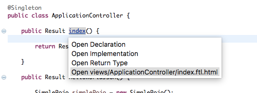

# ninjaframework-eclipse
This is an eclipse plugin for the [Ninja framework](www.ninjaframework.org).
ninjaframework-elipse needs JDT.

## eclipse update site:
```
http://raw.githubusercontent.com/mallowlabs/ninjaframework-eclipse/master/ninjaframework-eclipse.updatesite/site.xml
```

Current version: **0.1**

## Usage:
Just mouse hover on the method of controller.


You can jump to the Freemarker files for the method.
